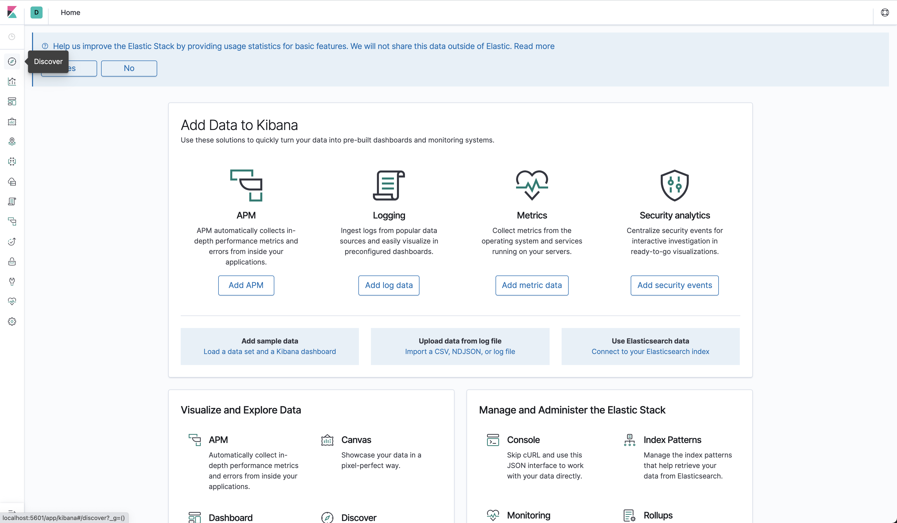
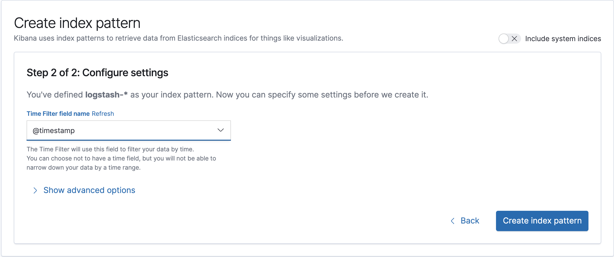
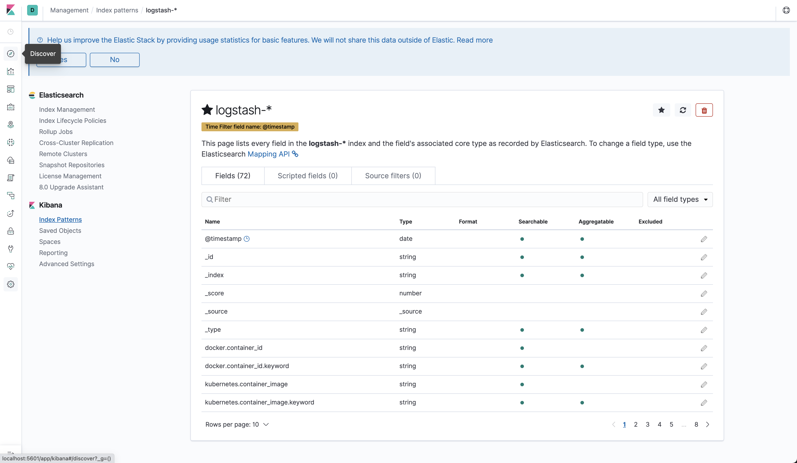
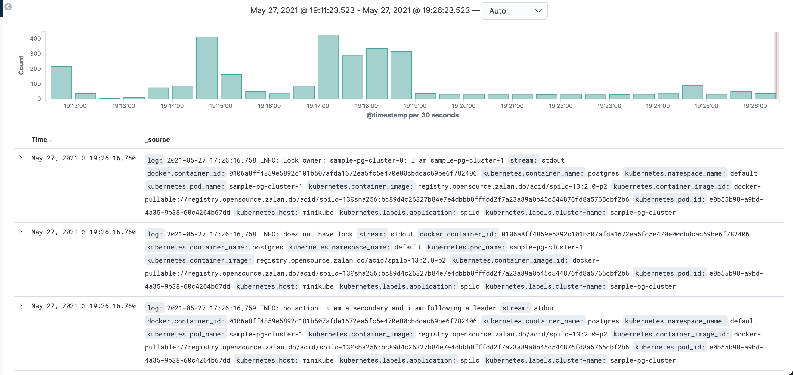
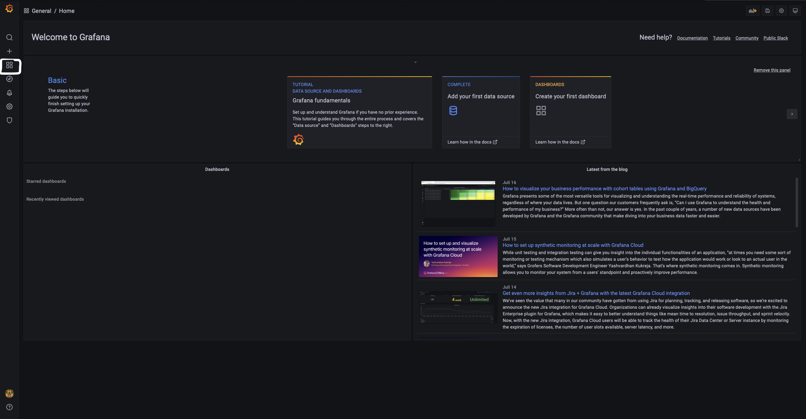
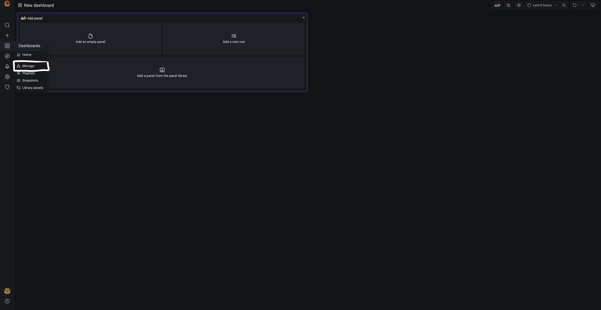
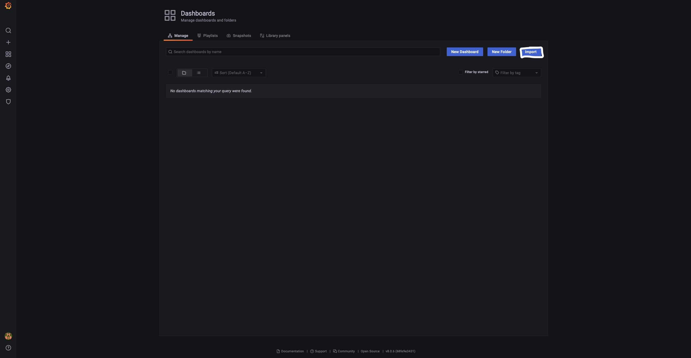
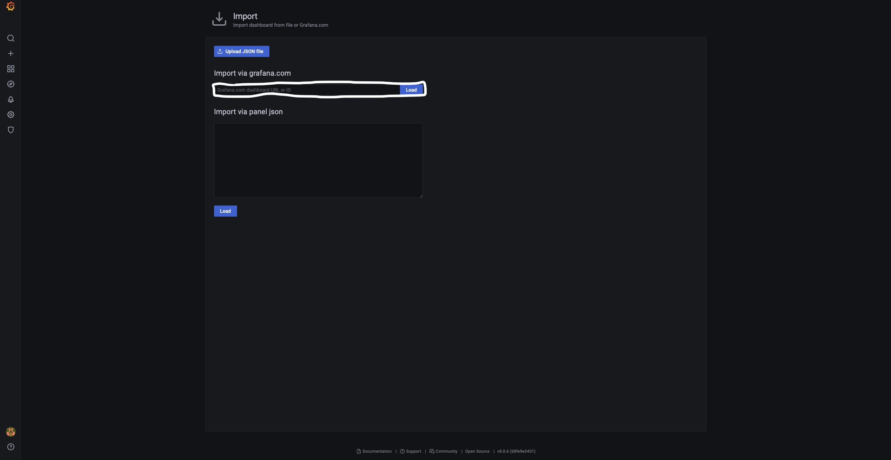
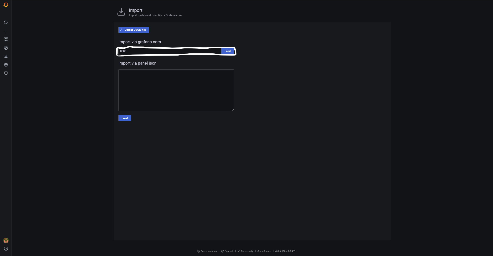
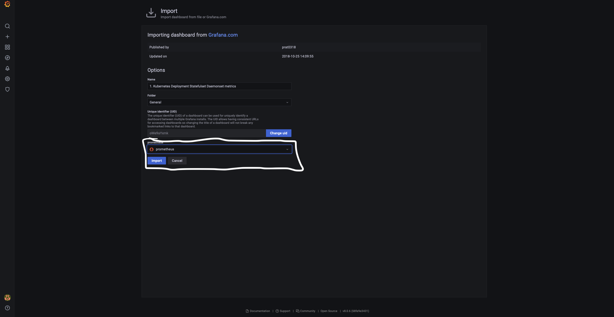

# a8s-deployment

**WARNING: This repo is WIP. We will cleanup, squash and force commit `main` in
the future.**

## minikube on macOS

### Prerequisites

```shell
minikube start
minikube addons enable registry

docker run --rm -it --network=host alpine ash -c "apk add socat && socat TCP-LISTEN:5000,reuseaddr,fork TCP:$(minikube ip):5000"
```

### Dashboard

#### Logging

##### Install Open Distro for Elasticsearch and Kibana

Ensure docker image for Open Search Kibana Dashboard is available.

```shell
cd docker
export IMG=localhost:5000/kibana
docker build -t $IMG .
docker push $IMG
cd ..
```

```shell
kubectl create namespace a8s-system
```

```shell
kubectl apply -f opendistro
```
#### Metrics

##### Install Grafana Dashboard

```shell
kubectl apply -f dashboard/grafana-configmap.yaml
kubectl apply -f dashboard/grafana-deployment.yaml
kubectl apply -f dashboard/grafana-service.yaml
```

### Logging

#### Install Fluent Bit DaemonSet as a log forwarder

```shell
kubectl apply -f logging/fluent-bit-daemonset-permissions.yaml
kubectl apply -f logging/fluent-bit-daemonset-configmap-forward-minikube.yaml
kubectl apply -f logging/fluent-bit-daemonset-forward-minikube.yaml
```

#### Install Fluentd statefulset as a log aggregator

```shell
cd Images/fluentd-aggregator/
export IMG=localhost:5000/fluentd
docker build -t $IMG .
docker push $IMG
cd ../..
```

```shell
kubectl apply -f logging/fluentd-aggregator-configmap.yaml
kubectl apply -f logging/fluentd-aggregator-service.yaml
kubectl apply -f logging/fluentd-aggregator-statefulset.yaml
```

#### Using Dashboard

First, get the Kibana pod name

```shell
kibana=$(kubectl get pod -l role=kibana --namespace a8s-system | grep kibana | awk -F ' ' '{print $1}')
```

Use port-forward to connect to the pod. This is just for testing purposes on
Minikube.

```shell
kubectl port-forward $kibana 5601:5601 --namespace=a8s-system
```

Open the Kibana dashboard in Browser link in browser.

```shell
open http://localhost:5601
```


Go to discover in the top left hand corner.



Create an index pattern for `logstash-*`. And click `> Next step`


Select `@timestamp` as a time filter field name. And then click
`Create index pattern`.



Go back to the discover tab.



The logs will be available to interact using your new filter.



#### Delete Fluent Bit DaemonSet Setup

```shell
kubectl delete -f logging/fluent-bit-daemonset-elasticsearch-minikube.yaml
kubectl delete -f logging/fluent-bit-daemonset-configmap-elasticsearch-minikube.yaml
kubectl delete -f logging/fluent-bit-daemonset-permissions.yaml
```

### Metrics

#### Install Prometheus as a Metrics Collector

```shell
kubectl apply -f metrics/prometheus-permissions.yaml
kubectl apply -f metrics/prometheus-configmap.yaml
kubectl apply -f metrics/prometheus-deployment.yaml
kubectl apply -f metrics/prometheus-service.yaml
```

#### Using Dashboard

In order to access the Grafana dashboard we need a port-forward to the Grafana
service:

```shell
kubectl port-forward -n a8s-system service/grafana 3000 &
```

Open the Grafana dashboard by issuing:

```shell
open localhost:3000
```

Log into the dashboard by using `admin` as a username as well as the password.
Afterwards we need to import a dashboard in order to visualize the Kubernetes
system metrics that are scraped by the Prometheus instance.



Go to the Dashboards section in the left menu.



Then go to the Manage page.



Click on Import on the right hand side.


 
 Then Insert `8588` as the Dashboard ID and click on Load.



Choose Prometheus as the data source.



Now the imported metrics dashboard should visualize some of the metrics
that are scraped by the Prometheus instance.

#### Delete Prometheus

```shell
kubectl delete -f metrics/prometheus-service.yaml
kubectl delete -f metrics/prometheus-deployment.yaml
kubectl delete -f metrics/prometheus-configmap.yaml
kubectl delete -f metrics/prometheus-permissions.yaml
```
