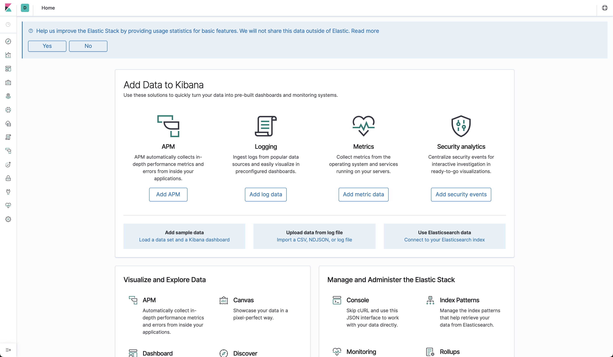
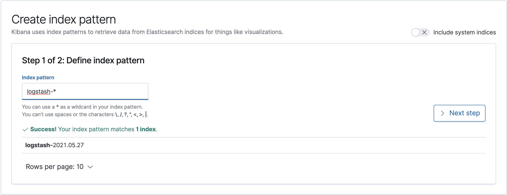

# a8s-deployment

**WARNING: This branch of the repo is DEPRECATED. It's an archive of the old version of this repo.
We chose to archive the old version of this repo when we decided to expose the repo to users. It
still contains a lot of things that core developers of the a8s team might want to check
occasionally, but as a user you should never need what's here; only what's in the `main` branch is
relevant to you.**

## minikube on macOS

### Prerequisites

```shell
minikube start
minikube addons enable registry

docker run --rm -it --network=host alpine ash -c "apk add socat && socat TCP-LISTEN:5000,reuseaddr,fork TCP:$(minikube ip):5000"
```

### Dashboard

#### Install Open Distro for Elasticsearch and Kibana

Ensure docker image for Open Search Kibana Dashboard is available.

```shell
cd docker
export IMG=localhost:5000/kibana
docker build -t $IMG .
docker push $IMG
cd ..
```

```shell
kubectl create namespace a8s-system
```

```shell
kubectl apply -f opendistro
```

### Logging

#### Install Fluent Bit DaemonSet as a log forwarder

```shell
kubectl apply -f logging/fluent-bit-daemonset-permissions.yaml
kubectl apply -f logging/fluent-bit-daemonset-configmap-forward-minikube.yaml
kubectl apply -f logging/fluent-bit-daemonset-forward-minikube.yaml
```

#### Install Fluentd statefulset as a log aggregator

```shell
kubectl apply -f logging/fluentd-aggregator-configmap.yaml
kubectl apply -f logging/fluentd-aggregator-service.yaml
kubectl apply -f logging/fluentd-aggregator-statefulset.yaml
```

#### Using Dashboard

First, get the Kibana pod name

```shell
kibana=$(kubectl get pod -l role=kibana --namespace a8s-system | grep kibana | awk -F ' ' '{print $1}')
```

Use port-forward to connect to the pod. This is just for testing purposes on
Minikube.

```shell
kubectl port-forward $kibana 5601:5601 --namespace=a8s-system
```

Open the Kibana dashboard in Browser link in browser.

```shell
open http://localhost:5601
```



Go to discover in the top left hand corner.


Create an index pattern for `logstash-*`. And click `> Next step`



Select `@timestamp` as a time filter field name. And then click
`Create index pattern`.


Go back to the discover tab.


The logs will be available to interact using your new filter.


#### Delete Fluent Bit DaemonSet Setup

```shell
kubectl delete -f logging/fluent-bit-daemonset-elasticsearch-minikube.yaml
kubectl delete -f logging/fluent-bit-daemonset-configmap-elasticsearch-minikube.yaml
kubectl delete -f logging/fluent-bit-daemonset-permissions.yaml
```
